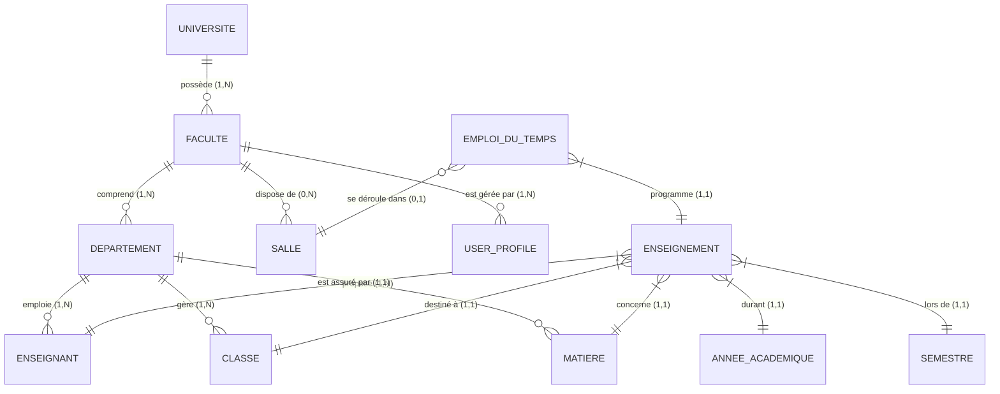
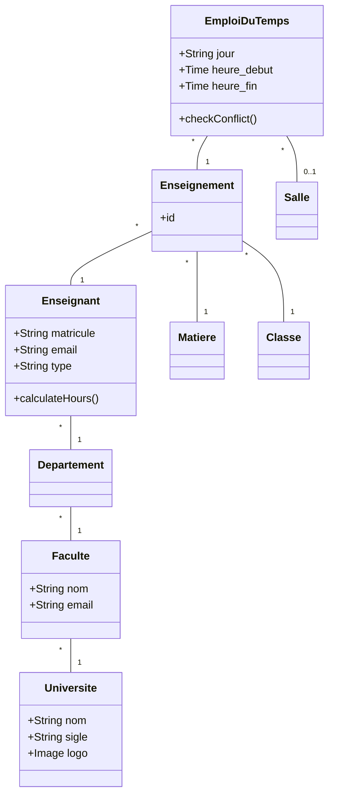
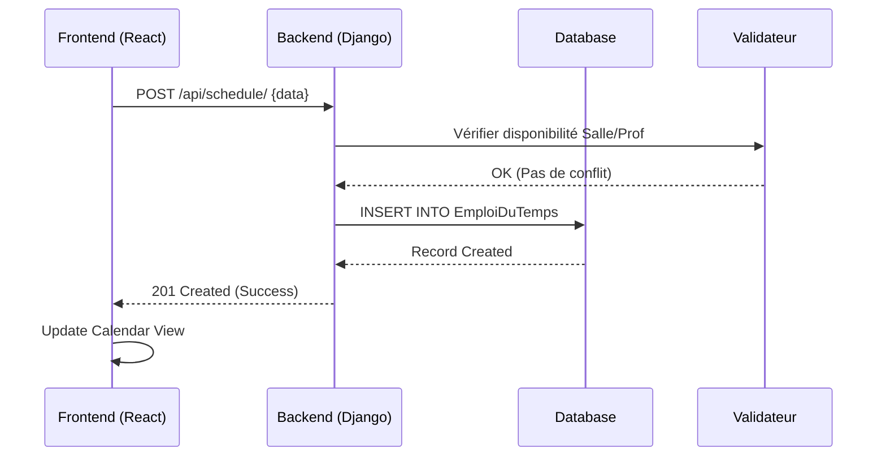
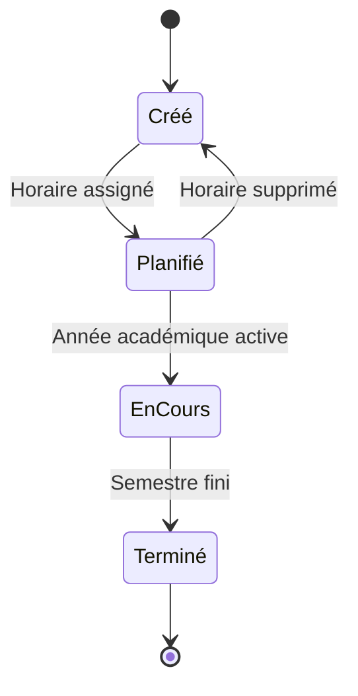

# Dossier de Conception et d'Analyse - Projet GESTENS


## 1. Introduction
### 1.1 Contexte
Le projet **GESTENS** (Système de Gestion des Enseignants et du Suivi Statistique) est une solution numérique conçue pour moderniser la gestion académique de l'Université Gamal Abdel Nasser de Conakry (UGANC). Face aux défis de la gestion manuelle (conflits d'horaires, perte de données, lenteur administrative), GESTENS propose une plateforme centralisée et sécurisée.

### 1.2 Objectifs
- **Automatisation** de la planification des emplois du temps.
- **Centralisation** des informations des enseignants, départements et classes.
- **Isolation des données** par faculté tout en conservant un socle commun.
- **Reporting** et génération de documents administratifs automatisés.

---

## 2. Analyse Fonctionnelle

### 2.1 Acteurs du Système
- **Administrateur Central (SuperUser) :** Gère l'université, les facultés et les accès globaux.
- **Administrateur de Faculté (Doyen/Directeur) :** Gère les départements, les enseignants, les salles et les maquettes de sa faculté.
- **Utilisateur (Public) :** Consulte les informations publiques de l'université.

### 2.2 Diagramme de Cas d'Utilisation
```mermaid
useCaseDiagram
    actor "Administrateur Central" as Admin
    actor "Administrateur Faculté" as FacAdmin
    actor "Enseignant/Public" as User

    package "GESTENS Core" {
        usecase "Gérer les Facultés" as UC1
        usecase "Gérer les Comptes" as UC2
        usecase "Gérer les Départements" as UC3
        usecase "Gérer les Enseignants" as UC4
        usecase "Planifier Emploi du Temps" as UC5
        usecase "Générer Rapports PDF" as UC6
        usecase "Gérer les Salles" as UC7
        usecase "Consulter Horaires" as UC8
    }

    Admin --> UC1
    Admin --> UC2
    
    FacAdmin --> UC3
    FacAdmin --> UC4
    FacAdmin --> UC5
    FacAdmin --> UC6
    FacAdmin --> UC7
    
    User --> UC8
```

---

## 3. Modélisation des Données

### 3.1 Modèle Conceptuel de Données (MCD)

#### Diagramme


#### Règles de Gestion et Cardinalités
- **UNIVERSITE ↔ FACULTE** : Une Université possède une ou plusieurs Facultés **(1,n)**. Une Faculté appartient à une seule Université **(1,1)**.
- **FACULTE ↔ DEPARTEMENT** : Une Faculté comprend un ou plusieurs Départements **(1,n)**. Un Département appartient à une seule Faculté **(1,1)**.
- **FACULTE ↔ SALLE** : Une Faculté dispose de zéro ou plusieurs Salles **(0,n)**. Une Salle appartient à une seule Faculté **(1,1)**.
- **DEPARTEMENT ↔ ENSEIGNANT** : Un Département emploie un ou plusieurs Enseignants **(1,n)**. Un Enseignant est rattaché à un seul Département **(1,1)**.
- **DEPARTEMENT ↔ CLASSE** : Un Département gère une ou plusieurs Classes **(1,n)**. Une Classe appartient à un seul Département **(1,1)**.
- **DEPARTEMENT ↔ MATIERE** : Un Département propose une ou plusieurs Matières **(1,n)**. Une Matière appartient à un seul Département **(1,1)**.
- **ENSEIGNANT ↔ ENSEIGNEMENT** : Un Enseignant assure un ou plusieurs Enseignements **(1,n)**. Un Enseignement est assuré par un seul Enseignant **(1,1)**.
- **CLASSE ↔ ENSEIGNEMENT** : Une Classe suit un ou plusieurs Enseignements **(1,n)**. Un Enseignement est destiné à une seule Classe **(1,1)**.
- **MATIERE ↔ ENSEIGNEMENT** : Une Matière fait l'objet d'un ou plusieurs Enseignements **(1,n)**. Un Enseignement concerne une seule Matière **(1,1)**.
- **ENSEIGNEMENT ↔ EMPLOI_DU_TEMPS** : Un Enseignement est programmé dans une ou plusieurs sessions d'emploi du temps **(1,n)**. Une session d'emploi du temps correspond à un seul Enseignement **(1,1)**.
- **SALLE ↔ EMPLOI_DU_TEMPS** : Une Salle accueille zéro ou plusieurs sessions d'emploi du temps **(0,n)**. Une session d'emploi du temps se déroule dans zéro ou une Salle **(0,1)** *(la salle pouvant être assignée plus tard)*.

### 3.2 Modèle Logique de Données (MLD)
Les entités principales sont structurées comme suit :

1.  **Universite** (<u>id</u>, nom, sigle, slogan, logo, email, republique)
2.  **Faculte** (<u>id</u>, nom, email, logo, *universite_id*)
3.  **Departement** (<u>id</u>, nom, description, *faculte_id*)
4.  **Enseignant** (<u>id</u>, matricule, prenom, nom, email, telephone, type, *departement_id*)
5.  **Enseignement** (<u>id</u>, *enseignant_id*, *matiere_id*, *classe_id*, *semestre_id*, *annee_id*)
6.  **EmploiDuTemps** (<u>id</u>, jour, heure_debut, heure_fin, *enseignement_id*, *salle_id*)

---

## 4. Conception Logicielle (UML)

### 4.1 Diagramme de Classes Détaillé


### 4.2 Diagramme de Séquence : Création d'un Horaire


### 4.3 Diagramme d'État : État d'un Enseignement


---

## 5. Architecture Technique

### 5.1 Stack Technologique
| Composant | Technologie | Rôle |
| :--- | :--- | :--- |
| **Frontend** | React 18 / Tailwind | Interface utilisateur dynamique et responsive |
| **State Management** | React Hooks / Context API | Gestion de l'état global (User, Faculty) |
| **Backend** | Django 5.x / DRF | Logique métier, API REST et Authentification JWT |
| **Base de Données** | PostgreSQL (Prod) / SQLite (Dev) | Stockage relationnel persistant |
| **Stockage Fichiers** | Django Media | Stockage des logos et photos de profil |

### 5.2 Sécurité
- **JWT (JSON Web Tokens) :** Pour l'authentification sans état.
- **CORS :** Configuration restrictive pour n'autoriser que le frontend.
- **Isolation :** Utilisation de `faculte_id` dans toutes les requêtes pour garantir que les utilisateurs d'une faculté ne voient pas les données des autres.

---

## 6. Dictionnaire de Données Complet

### Table `Universite`
| Champ | Type | Contrainte | Description |
| :--- | :--- | :--- | :--- |
| id | AutoField | PK | Identifiant unique de l'université |
| nom | String (200) | NOT NULL | Nom complet de l'université |
| sigle | String (20) | NOT NULL | Sigle ou acronyme (ex: UGANC) |
| slogan | String (200) | NOT NULL | Slogan de l'université |
| logo | Image | NULLABLE | Logo officiel |
| republique | String (100) | NOT NULL | Mention de la république |
| email_contact | Email (100) | NOT NULL | Email principal de contact |
| bp | String (50) | NOT NULL | Boîte postale |

### Table `Faculte`
| Champ | Type | Contrainte | Description |
| :--- | :--- | :--- | :--- |
| id | AutoField | PK | Identifiant unique de la faculté |
| nom | String (150) | NOT NULL | Nom complet de la faculté |
| logo | Image | NULLABLE | Logo spécifique à la faculté |
| email | Email (100) | UNIQUE, NOT NULL | Email de contact de la faculté |
| universite | FK | NULLABLE | Clé étrangère vers l'Université |

### Table `UserProfile`
| Champ | Type | Contrainte | Description |
| :--- | :--- | :--- | :--- |
| id | AutoField | PK | Identifiant unique du profil |
| user | OneToOne | UNIQUE, NOT NULL | Lien vers l'utilisateur standard Django |
| faculte | FK | NOT NULL | Faculté à laquelle l'utilisateur est rattaché |
| photo | Image | NULLABLE | Photo de profil de l'utilisateur |

### Table `AnneeAcademique`
| Champ | Type | Contrainte | Description |
| :--- | :--- | :--- | :--- |
| id | AutoField | PK | Identifiant unique de l'année |
| nom | String (20) | UNIQUE, NOT NULL | Libellé (ex: 2023-2024) |
| description | Text | NULLABLE | Détails supplémentaires |
| is_current | Boolean | DEFAULT True | Indique si c'est l'année en cours |

### Table `Salle`
| Champ | Type | Contrainte | Description |
| :--- | :--- | :--- | :--- |
| id | AutoField | PK | Identifiant unique de la salle |
| nom | String (100) | NOT NULL | Nom ou numéro de la salle |
| capacite | Integer | NULLABLE | Nombre de places disponibles |
| faculte | FK | NOT NULL | Faculté propriétaire de la salle |

### Table `Departement`
| Champ | Type | Contrainte | Description |
| :--- | :--- | :--- | :--- |
| id | AutoField | PK | Identifiant unique du département |
| nom | String (150) | NOT NULL | Nom du département |
| description | Text | NULLABLE | Description du département |
| faculte | FK | NOT NULL | Faculté de rattachement |

### Table `Enseignant`
| Champ | Type | Contrainte | Description |
| :--- | :--- | :--- | :--- |
| id | AutoField | PK | Identifiant unique de l'enseignant |
| matricule | String (50) | UNIQUE, NOT NULL | Matricule officiel |
| prenom | String (100) | NOT NULL | Prénom(s) |
| nom | String (100) | NOT NULL | Nom de famille |
| date_naissance | Date | NULLABLE | Date de naissance |
| telephone | String (20) | NULLABLE | Numéro de téléphone |
| email | Email (100) | UNIQUE, NOT NULL | Adresse email |
| specialite | String (150) | NULLABLE | Domaine de spécialité |
| dernier_diplome | String (100) | NULLABLE | Le diplôme le plus élevé |
| grade_academique| String (100) | NULLABLE | Grade actuel |
| fonction | String (100) | NULLABLE | Fonction exercée |
| type | Enum | NOT NULL | Type de contrat (National / Etranger) |
| departement | FK | NOT NULL | Département d'appartenance |
| photo | Image | NULLABLE | Photo de l'enseignant |

### Table `Classe`
| Champ | Type | Contrainte | Description |
| :--- | :--- | :--- | :--- |
| id | AutoField | PK | Identifiant unique de la classe |
| nom | String (100) | NOT NULL | Nom de la classe |
| niveau | String (50) | NOT NULL | Niveau académique (L1, L2, M1, etc.) |
| departement | FK | NOT NULL | Département auquel appartient la classe |

### Table `Matiere`
| Champ | Type | Contrainte | Description |
| :--- | :--- | :--- | :--- |
| id | AutoField | PK | Identifiant unique de la matière |
| nom | String (150) | NOT NULL | Nom de la matière |
| code | String (20) | UNIQUE, NOT NULL | Code unique de la matière |
| departement | FK | NOT NULL | Département gérant la matière |

### Table `Semestre`
| Champ | Type | Contrainte | Description |
| :--- | :--- | :--- | :--- |
| id | AutoField | PK | Identifiant unique du semestre |
| nom | String (5) | UNIQUE, NOT NULL | Libellé (ex: S1, S2) |
| type | Enum | NOT NULL | Type de semestre (Impair / Pair) |

### Table `Enseignement`
| Champ | Type | Contrainte | Description |
| :--- | :--- | :--- | :--- |
| id | AutoField | PK | Identifiant unique de l'enseignement |
| enseignant | FK | NOT NULL | Enseignant dispensant le cours |
| matiere | FK | NOT NULL | Matière enseignée |
| classe | FK | NOT NULL | Classe cible |
| semestre | FK | NOT NULL | Semestre concerné |
| annee_academique| FK | NULLABLE | Année académique en cours |

### Table `EmploiDuTemps`
| Champ | Type | Contrainte | Description |
| :--- | :--- | :--- | :--- |
| id | AutoField | PK | Identifiant unique de l'horaire |
| jour | Enum | NOT NULL | Jour de la semaine (Lundi..Dimanche) |
| heure_debut | Time | NOT NULL | Heure de début |
| heure_fin | Time | NOT NULL | Heure de fin |
| enseignement | FK | NOT NULL | Cours concerné |
| salle | FK | NULLABLE | Salle où se déroule le cours |

### Table `RecentActivity`
| Champ | Type | Contrainte | Description |
| :--- | :--- | :--- | :--- |
| id | AutoField | PK | Identifiant unique du journal |
| user | FK | NOT NULL | Utilisateur ayant fait l'action |
| description | String (255) | NOT NULL | Description de l'activité |
| target_name | String (150) | NULLABLE | Entité cible affectée |
| action_type | Enum | DEFAULT 'info' | Type d'action (create, update, delete, info) |
| timestamp | DateTime | AUTO_NOW_ADD | Date et heure de l'action |
| faculte | FK | NULLABLE | Faculté concernée par l'action |
| is_archived | Boolean | DEFAULT False | Indique si l'activité est archivée |

---

## 7. Conclusion
Le document de conception définit une base solide pour le développement de GESTENS. L'architecture modulaire permet une évolution facile, notamment l'ajout futur de modules de paie ou de gestion des notes des étudiants.
