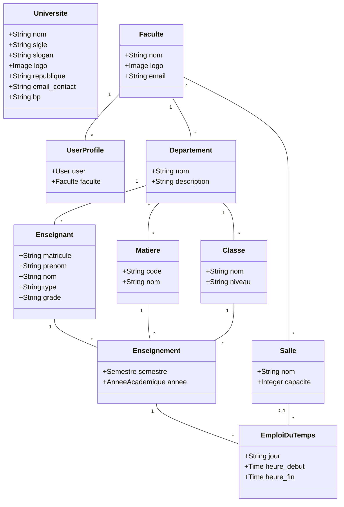
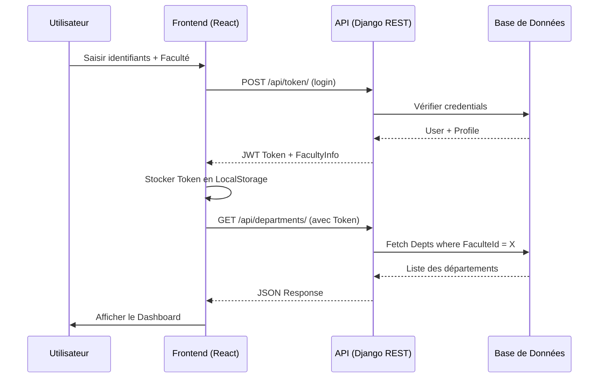

# Dossier de Conception - Projet GESTENS

## 1. Introduction
Le projet **GESTENS** (Gestion des Enseignants et des Statistiques) est une plateforme web visant à automatiser et centraliser la gestion académique au sein de l'Université Gamal Abdel Nasser de Conakry (UGANC). Elle permet une gestion multi-facultés où chaque entité dispose d'une isolation de ses données tout en partageant une infrastructure commune.

---

## 2. Diagrammes UML

### 2.1 Diagramme de Cas d'Utilisation
Ce diagramme définit les interactions entre les acteurs et le système.

```mermaid
useCaseDiagram
    actor "Administrateur Central" as Admin
    actor "Directeur de Faculté" as Director
    actor "Public / Visiteur" as Public

    Admin --> (Gérer l'Université et les Facultés)
    Admin --> (Gérer les Comptes Utilisateurs)
    
    Director --> (Gérer les Départements)
    Director --> (Gérer les Enseignants)
    Director --> (Gérer les Maquettes de Cours)
    Director --> (Générer l'Emploi du Temps)
    Director --> (Imprimer les Documents Officiels)
    
    Public --> (Visualiser les Facultés)
    Public --> (Consulter les Informations de l'Université)
```

### 2.2 Diagramme de Classes
Représentation des entités du système et de leurs relations.



### 2.3 Diagramme d'Activité : Création d'un Emploi du Temps
Processus métier pour la planification d'un cours.

```mermaid
activityDiagram
    start
    :Sélectionner le menu Emploi du Temps;
    :Cliquer sur "Ajouter un cours";
    if (Enseignement existe ?) then (oui)
        :Sélectionner l'enseignement (Prof/Matière/Classe);
    else (non)
        :Créer d'abord l'Enseignement;
        :Revenir à l'Emploi du Temps;
    endif
    :Définir le jour et les heures;
    :Affecter une salle (optionnel);
    :Enregistrer;
    :Vérification des conflits (Système);
    stop
```

### 2.4 Diagramme de Séquence : Authentification et Chargement
Flux entre le Frontend, l'API et la Base de Données.



---

## 3. Modélisation des Données

### 3.1 Modèle Conceptuel de Données (MCD)
- **UNIVERSITE** (1,1) --- [POSSEDE] --- (1,N) **FACULTE**
- **FACULTE** (1,1) --- [CONTIENT] --- (1,N) **DEPARTEMENT**
- **DEPARTEMENT** (1,1) --- [RATTACHE] --- (1,N) **ENSEIGNANT** / **CLASSE** / **MATIERE**
- **ENSEIGNANT** (1,N) --- [DISPENSE] --- (1,N) **MATIERE** (via **ENSEIGNEMENT**)
- **ENSEIGNEMENT** (1,1) --- [PROGRAMME] --- (1,N) **EMPLOIDUTEMPS**

### 3.2 Modèle Relationnel de Données (MRD)
*Les clés primaires sont en gras, les clés étrangères avec (#).*

- **Universite** (**id**, nom, sigle, slogan, logo, republique, email_contact, bp)
- **Faculte** (**id**, nom, logo, email)
- **UserProfile** (**id**, user_id#, faculte_id#)
- **Salle** (**id**, nom, capacite, faculte_id#)
- **Departement** (**id**, nom, description, faculte_id#)
- **Enseignant** (**id**, prenom, nom, email, matricule, type, departement_id#)
- **Classe** (**id**, nom, niveau, departement_id#)
- **Matiere** (**id**, nom, code, departement_id#)
- **Enseignement** (**id**, enseignant_id#, matiere_id#, classe_id#, semestre_id#, annee_id#)
- **EmploiDuTemps** (**id**, jour, heure_debut, heure_fin, enseignement_id#, salle_id#)

---

## 4. Architecture Technique
- **Backend** : Django 5.x avec Django REST Framework pour l'exposition des APIs.
- **Frontend** : React 18+ (Vite) avec Framer Motion pour les animations et Lucide-React pour l'iconographie.
- **Sécurité** : JWT (JSON Web Token) avec isolation des données par `faculte_id` au niveau des requêtes SQL.
- **Design** : Glassmorphism, Responsive Design (Mobile First) et support du Theme Switching (Dark/Light).
